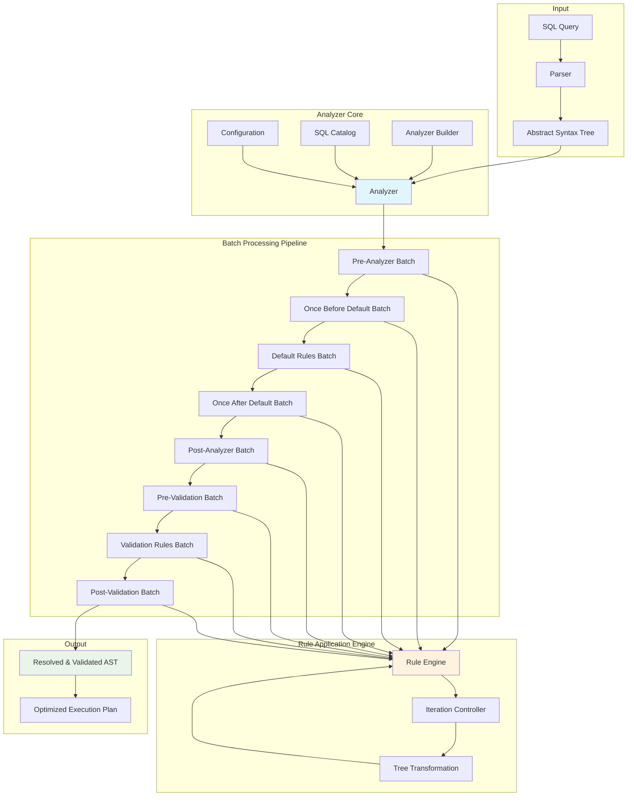
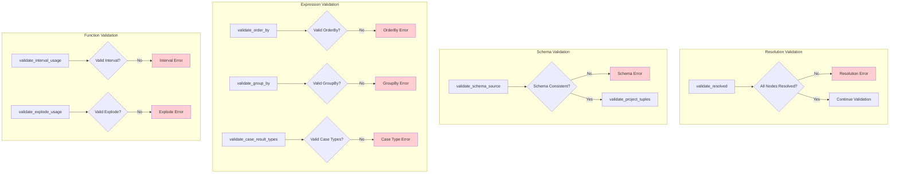
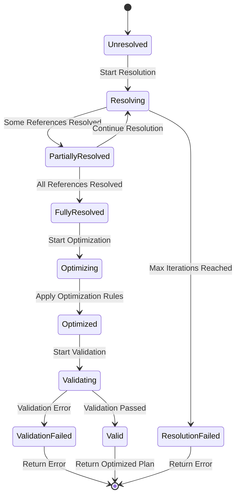

# Go MySQL Server - Analyzer Logic Architecture

## Analyzer Processing Pipeline



## Rule Categories and Processing Order

```mermaid
graph LR
    subgraph "Pre-Analyzer Rules"
        PA[Custom Pre-Analysis Rules]
    end

    subgraph "Once Before Default"
        OBD1[resolve_views]
        OBD2[resolve_subqueries]
        OBD3[resolve_tables]
        OBD4[check_aliases]
    end

    subgraph "Default Rules (Iterative)"
        DR1[resolve_natural_joins]
        DR2[resolve_orderby_literals]
        DR3[resolve_orderby]
        DR4[resolve_grouping_columns]
        DR5[qualify_columns]
        DR6[resolve_columns]
        DR7[resolve_database]
        DR8[resolve_star]
        DR9[resolve_functions]
        DR10[resolve_having]
        DR11[merge_union_schemas]
        DR12[reorder_aggregations]
        DR13[reorder_projection]
        DR14[move_join_conds_to_filter]
        DR15[eval_filter]
        DR16[optimize_distinct]
    end

    subgraph "Once After Default"
        OAD1[resolve_generators]
        OAD2[remove_unnecessary_converts]
        OAD3[assign_catalog]
        OAD4[prune_columns]
        OAD5[optimize_joins]
        OAD6[push_down_filters]
        OAD7[push_down_projections]
        OAD8[parallelize]
        OAD9[insert_topn]
    end

    subgraph "Validation Rules"
        VR1[validate_resolved]
        VR2[validate_order_by]
        VR3[validate_group_by]
        VR4[validate_schema_source]
        VR5[validate_project_tuples]
        VR6[validate_index_creation]
        VR7[validate_case_result_types]
    end

    PA --> OBD1
    OBD1 --> OBD2
    OBD2 --> OBD3
    OBD3 --> OBD4
    OBD4 --> DR1
    
    DR1 --> DR2
    DR2 --> DR3
    DR3 --> DR4
    DR4 --> DR5
    DR5 --> DR6
    DR6 --> DR7
    DR7 --> DR8
    DR8 --> DR9
    DR9 --> DR10
    DR10 --> DR11
    DR11 --> DR12
    DR12 --> DR13
    DR13 --> DR14
    DR14 --> DR15
    DR15 --> DR16

    DR16 --> OAD1
    OAD1 --> OAD2
    OAD2 --> OAD3
    OAD3 --> OAD4
    OAD4 --> OAD5
    OAD5 --> OAD6
    OAD6 --> OAD7
    OAD7 --> OAD8
    OAD8 --> OAD9

    OAD9 --> VR1
    VR1 --> VR2
    VR2 --> VR3
    VR3 --> VR4
    VR4 --> VR5
    VR5 --> VR6
    VR6 --> VR7
```



## Rule Types and Their Functions

### 1. Resolution Rules

```mermaid
graph TB
    subgraph "Table Resolution"
        UnresolvedTable[UnresolvedTable] --> ResolveTables[resolve_tables]
        ResolveTables --> ResolvedTable[ResolvedTable]
        ResolveTables --> DualTable[DUAL Table]
        ResolveTables --> Catalog[Catalog Lookup]
    end

    subgraph "Column Resolution"
        UnresolvedColumn[UnresolvedColumn] --> ResolveColumns[resolve_columns]
        ResolveColumns --> GetField[GetField]
        ResolveColumns --> QualifyColumns[qualify_columns]
        Star[*] --> ResolveStar[resolve_star]
        ResolveStar --> ExpandedColumns[Expanded Columns]
    end

    subgraph "Function Resolution"
        UnresolvedFunction[UnresolvedFunction] --> ResolveFunctions[resolve_functions]
        ResolveFunctions --> Function[Function Implementation]
        ResolveFunctions --> FunctionRegistry[Function Registry]
    end

    subgraph "Expression Resolution"
        UnresolvedExpr[Unresolved Expressions] --> ResolveOrderBy[resolve_orderby]
        ResolveOrderBy --> OrderByExpr[OrderBy Expression]
        GroupingExpr[Grouping Expression] --> ResolveGrouping[resolve_grouping_columns]
        HavingExpr[Having Expression] --> ResolveHaving[resolve_having]
    end

    style UnresolvedTable fill:#ffebee
    style UnresolvedColumn fill:#ffebee
    style UnresolvedFunction fill:#ffebee
    style ResolvedTable fill:#e8f5e8
    style GetField fill:#e8f5e8
    style Function fill:#e8f5e8
```


### 2. Optimization Rules

```mermaid
graph TB
    subgraph "Join Optimization"
        Joins[Join Conditions] --> MoveJoinConds[move_join_conds_to_filter]
        MoveJoinConds --> OptimizeJoins[optimize_joins]
        OptimizeJoins --> EfficientJoins[Efficient Join Plans]
    end

    subgraph "Projection Optimization"
        Projections[Projections] --> PruneColumns[prune_columns]
        PruneColumns --> ReorderProjection[reorder_projection]
        ReorderProjection --> PushDownProjections[push_down_projections]
        PushDownProjections --> MinimalColumns[Minimal Column Set]
    end

    subgraph "Filter Optimization"
        Filters[Filter Conditions] --> EvalFilter[eval_filter]
        EvalFilter --> PushDownFilters[push_down_filters]
        PushDownFilters --> EarlyFiltering[Early Filtering]
    end

    subgraph "Aggregation Optimization"
        Aggregations[Aggregations] --> ReorderAggregations[reorder_aggregations]
        ReorderAggregations --> OptimizeDistinct[optimize_distinct]
        OptimizeDistinct --> EfficientAggregation[Efficient Aggregation]
    end

    subgraph "Performance Optimization"
        ParallelOps[Parallel Operations] --> Parallelize[parallelize]
        Parallelize --> TopN[insert_topn]
        TopN --> PerformantExecution[Performant Execution]
    end

    style EfficientJoins fill:#e3f2fd
    style MinimalColumns fill:#e3f2fd
    style EarlyFiltering fill:#e3f2fd
    style EfficientAggregation fill:#e3f2fd
    style PerformantExecution fill:#e3f2fd
```


### 3. Validation Rules


## Analyzer State Machine



## Batch Execution Flow

```mermaid
sequenceDiagram
    participant C as Client
    participant A as Analyzer
    participant B as Batch
    participant R as Rule
    participant N as Node

    C->>A: Analyze(node)
    A->>A: Log Analysis Start
    
    loop For Each Batch
        A->>B: Eval(ctx, analyzer, node)
        
        loop For Max Iterations
            B->>B: evalOnce()
            
            loop For Each Rule in Batch
                B->>R: Apply(ctx, analyzer, node)
                R->>N: Transform Node Tree
                N->>R: Return Transformed Node
                R->>B: Return New Node
            end
            
            B->>B: Check if Node Changed
            alt Node Changed
                B->>B: Continue Next Iteration
            else Node Unchanged
                B->>A: Return Stabilized Node
                break
            end
        end
        
        alt Max Iterations Reached
            B->>A: Return ErrMaxAnalysisIters
        else Success
            B->>A: Return Processed Node
        end
    end
    
    A->>C: Return Final Node
```

## Key Analyzer Patterns

### 1. **Rule-Based Architecture**
- Each rule is a function: `(context, analyzer, node) → (node, error)`
- Rules are stateless and composable
- Rules can be applied multiple times until convergence

### 2. **Bottom-Up Tree Transformation**
- Uses `plan.TransformUp()` for tree traversal
- Children are processed before parents
- Enables dependency resolution and optimization

### 3. **Iterative Convergence**
- Rules applied repeatedly until no changes occur
- Maximum iteration limit prevents infinite loops
- Each batch has its own iteration strategy

### 4. **Phase-Based Processing**
- **Resolution**: Convert unresolved references to resolved ones
- **Optimization**: Improve query performance
- **Validation**: Ensure semantic correctness

### 5. **Extensible Design**
- Custom rules can be added via Builder pattern
- Pre/post hooks for custom analysis phases
- Pluggable catalog and function registry

## Error Handling Strategy

The analyzer uses a layered error handling approach:

1. **Rule Level**: Individual rules can return errors
2. **Batch Level**: Batches handle iteration limits and convergence
3. **Analyzer Level**: Top-level error aggregation and logging
4. **Validation**: Dedicated validation rules catch semantic errors

This architecture provides a robust, extensible framework for transforming SQL ASTs from parsed form into optimized, validated execution plans.