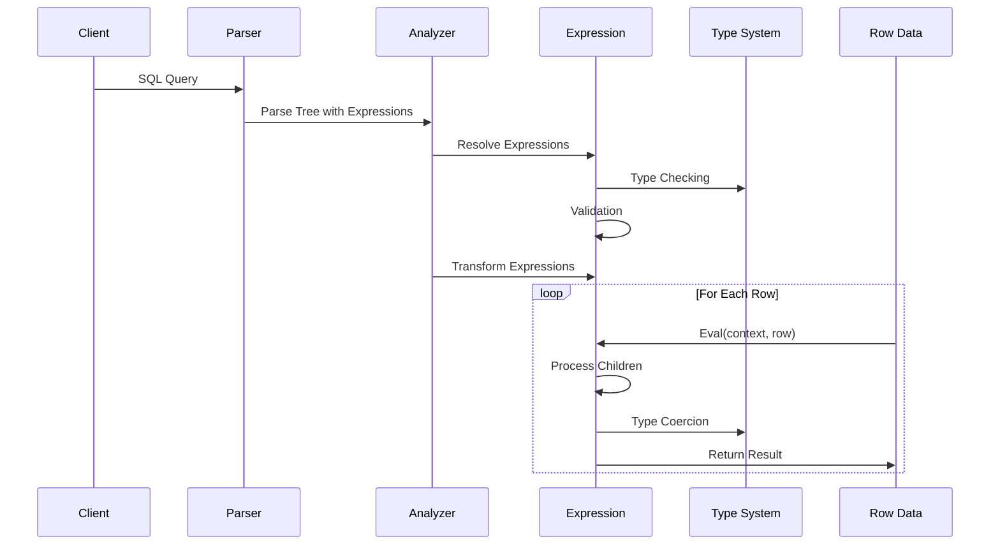
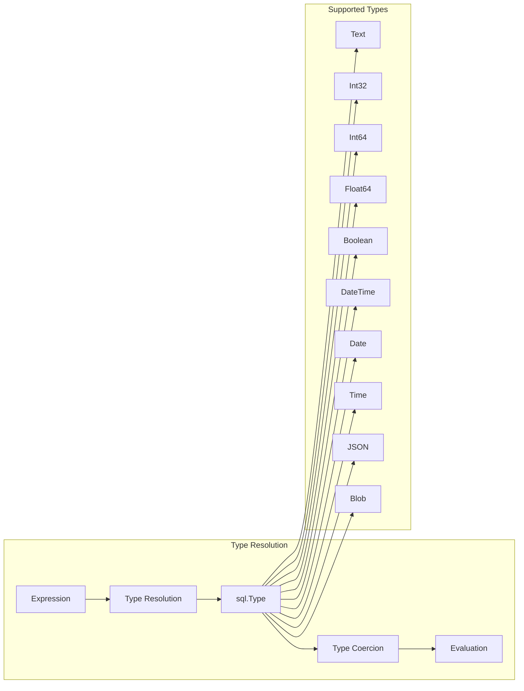
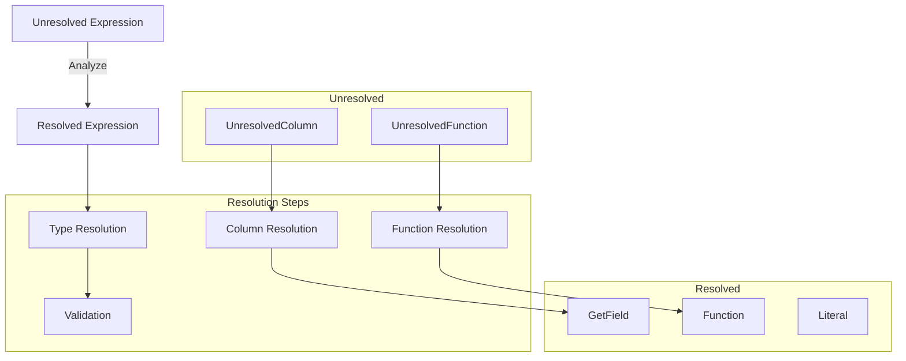

# Go MySQL Server - Expression Logic Architecture

## Expression Hierarchy

```mermaid
graph TB
    subgraph "Core Interface"
        EI[Expression Interface]
        EI --> |Type| Type[sql.Type]
        EI --> |Eval| Eval[Context, Row → interface{}]
        EI --> |Children| Children[[]Expression]
        EI --> |WithChildren| WithChildren[...Expression → Expression]
        EI --> |IsNullable| IsNullable[bool]
        EI --> |Resolved| Resolved[bool]
        EI --> |String| String[string]
    end

    subgraph "Base Expression Types"
        UE[UnaryExpression]
        BE[BinaryExpression]
        LE[Leaf Expression]
    end

    subgraph "Literal & Constants"
        Lit[Literal]
        Def[Default]
        GetField[GetField]
        Null[Null]
    end

    subgraph "Arithmetic Expressions"
        Arith[Arithmetic]
        Plus[Plus]
        Minus[Minus]
        Mult[Mult]
        Div[Div]
        Mod[Mod]
        UnaryMinus[UnaryMinus]
    end

    subgraph "Comparison Expressions"
        Comp[Comparer Interface]
        Eq[Equals]
        Neq[NotEquals]
        GT[GreaterThan]
        GTE[GreaterThanOrEqual]
        LT[LessThan]
        LTE[LessThanOrEqual]
        Like[Like]
        NotLike[NotLike]
        In[In]
        NotIn[NotIn]
        IsNull[IsNull]
        IsNotNull[IsNotNull]
        Between[Between]
        NotBetween[NotBetween]
    end

    subgraph "Logical Expressions"
        Logic[Logic]
        And[And]
        Or[Or]
        Not[Not]
        Xor[Xor]
    end

    subgraph "Function Expressions"
        Func[Function Interface]
        BuiltIn[Built-in Functions]
        Agg[Aggregation Functions]
        UserDef[User-Defined Functions]
    end

    subgraph "Control Flow"
        Case[Case]
        If[If]
        Coalesce[Coalesce]
        NullIf[NullIf]
    end

    subgraph "Utility Expressions"
        Alias[Alias]
        Convert[Convert]
        Cast[Cast]
        Interval[Interval]
        Tuple[Tuple]
        Star[Star]
    end

    subgraph "Unresolved Expressions"
        UnresCol[UnresolvedColumn]
        UnresFunc[UnresolvedFunction]
    end

    %% Inheritance relationships
    EI --> UE
    EI --> BE
    EI --> LE

    UE --> Alias
    UE --> Not
    UE --> UnaryMinus
    UE --> IsNull
    UE --> IsNotNull
    UE --> Cast
    UE --> Convert

    BE --> Arith
    BE --> Comp
    BE --> Logic
    BE --> Between
    BE --> Like

    LE --> Lit
    LE --> Def
    LE --> GetField
    LE --> Null
    LE --> UnresCol

    %% Specific implementations
    Arith --> Plus
    Arith --> Minus
    Arith --> Mult
    Arith --> Div
    Arith --> Mod

    Comp --> Eq
    Comp --> Neq
    Comp --> GT
    Comp --> GTE
    Comp --> LT
    Comp --> LTE

    Logic --> And
    Logic --> Or
    Logic --> Xor

    Like --> NotLike
    Between --> NotBetween
    In --> NotIn

    %% Function hierarchy
    Func --> BuiltIn
    Func --> Agg
    Func --> UserDef
    EI --> Func

    style EI fill:#e1f5fe
    style UE fill:#f3e5f5
    style BE fill:#f3e5f5
    style LE fill:#f3e5f5
    style Func fill:#fff3e0
    style Comp fill:#e8f5e8
    style Logic fill:#fce4ec
```

## Expression Evaluation Flow



## Key Expression Patterns

### 1. Expression Interface Implementation

```go
type Expression interface {
    Type() Type                           // Return result type
    IsNullable() bool                    // Can return NULL?
    Eval(*Context, Row) (interface{}, error) // Evaluate expression
    Children() []Expression             // Child expressions
    WithChildren(...Expression) (Expression, error) // Clone with new children
    Resolved() bool                     // All references resolved?
    String() string                     // String representation
}
```

### 2. Base Expression Types

#### UnaryExpression
- **Purpose**: Single child expression
- **Examples**: NOT, UnaryMinus, IsNull, Cast
- **Pattern**: Operates on one operand

#### BinaryExpression  
- **Purpose**: Two child expressions
- **Examples**: AND, OR, +, -, =, <, >
- **Pattern**: Operates on left and right operands

#### Leaf Expression
- **Purpose**: No child expressions
- **Examples**: Literal, GetField, UnresolvedColumn
- **Pattern**: Base values or references

### 3. Expression Categories

#### Arithmetic Expressions
```
Expression Tree for "a + b * c":
    Plus
    ├── GetField(a)
    └── Mult
        ├── GetField(b)
        └── GetField(c)
```

#### Logical Expressions
```
Expression Tree for "x AND (y OR z)":
    And
    ├── GetField(x)
    └── Or
        ├── GetField(y)
        └── GetField(z)
```

#### Comparison Expressions
```
Expression Tree for "age BETWEEN 18 AND 65":
    Between
    ├── GetField(age)
    ├── Literal(18)
    └── Literal(65)
```

### 4. Function System

#### Built-in Functions
- String functions: CONCAT, SUBSTRING, LENGTH
- Math functions: ABS, SQRT, POWER
- Date functions: NOW, DATE_FORMAT, YEAR
- Conditional: IF, CASE, COALESCE

#### Aggregation Functions
- COUNT, SUM, AVG, MIN, MAX
- GROUP_CONCAT, FIRST, LAST

### 5. Type System Integration



### 6. Resolution Process



### 7. Expression Transformation

The system uses the Visitor pattern for expression transformation:

```go
// Transform all expressions in a tree
func TransformUp(expr Expression, f TransformExprFunc) (Expression, error)

// Transform specific expression types
func TransformExpression(expr Expression, rule Rule) Expression
```

## Expression Lifecycle

1. **Parsing**: SQL text → Unresolved expressions
2. **Analysis**: Unresolved → Resolved expressions  
3. **Optimization**: Expression tree optimization
4. **Execution**: Row-by-row evaluation
5. **Type Coercion**: Automatic type conversion
6. **Result**: Final computed values

This architecture provides a flexible, extensible system for handling all types of SQL expressions while maintaining type safety and performance.