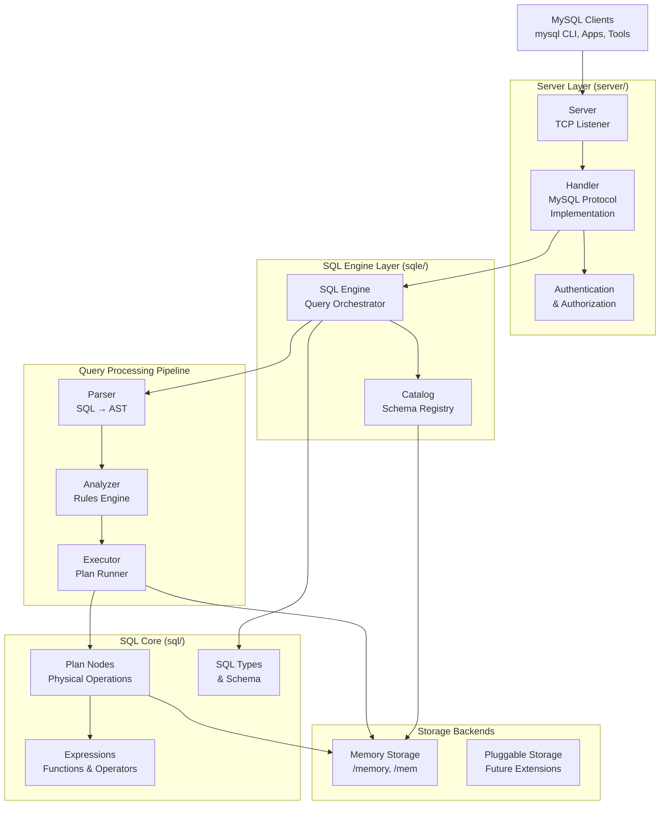

# Go MySQL Server - Technical Architecture

This is a sophisticated MySQL-compatible database server implementation in Go. Here's the comprehensive technical architecture:

## High-Level System Architecture



## Detailed Component Architecture

### 1. Server Layer (`server/`)
```
┌─────────────────────────────────────────┐
│              SERVER LAYER               │
├─────────────────┬───────────────────────┤
│     Server      │       Handler         │
│                 │                       │
│ • TCP Listener  │ • MySQL Protocol      │
│ • Connection    │ • Query Processing    │
│   Management    │ • Session Management  │
│ • TLS Support   │ • Result Formatting   │
└─────────────────┴───────────────────────┘
           │                    │
           ▼                    ▼
    ┌─────────────┐    ┌─────────────────┐
    │    Auth     │    │   SQL Engine    │
    │             │    │                 │
    │ • Native    │    │ • Query()       │
    │ • Audit     │    │ • Execute()     │
    │ • None      │    │                 │
    └─────────────┘    └─────────────────┘
```

**Key Components:**
- **Server**: TCP listener using Vitess MySQL protocol implementation
- **Handler**: Processes MySQL wire protocol messages and manages sessions
- **Authentication**: Multiple auth backends (Native, None, Audit)

### 2. SQL Engine Core
```
┌─────────────────────────────────────────────────────┐
│                   SQL ENGINE                        │
├─────────────────┬─────────────────┬─────────────────┤
│     Engine      │     Catalog     │   Function      │
│                 │                 │   Registry      │
│ • Query()       │ • Databases     │                 │
│ • QueryWithCtx()│ • Functions     │ • Built-ins     │
│ • Analyzer      │ • Procedures    │ • User-defined  │
│ • Auth          │ • Views         │                 │
└─────────────────┴─────────────────┴─────────────────┘
```

**Key Components:**
- **Engine**: Main orchestrator coordinating all query processing
- **Catalog**: Registry for databases, tables, functions, and schema metadata
- **Function Registry**: Manages built-in and user-defined functions

### 3. Query Processing Pipeline
```
   SQL Text
      │
      ▼
┌─────────────┐    ┌─────────────┐    ┌─────────────┐
│   PARSER    │───▶│  ANALYZER   │───▶│  EXECUTOR   │
│             │    │             │    │             │
│ • Lexical   │    │ • Rules     │    │ • Iterator  │
│   Analysis  │    │ • Validation│    │   Based     │
│ • Syntax    │    │ • Resolution│    │ • Row by    │
│   Tree      │    │ • Optimize  │    │   Row       │
│ • AST Nodes │    │             │    │             │
└─────────────┘    └─────────────┘    └─────────────┘
      │                    │                    │
      ▼                    ▼                    ▼
   Parse Tree         Analyzed Tree         Results
```

**Processing Stages:**
1. **Parser**: Converts SQL text into Abstract Syntax Tree (AST)
2. **Analyzer**: Applies rules for resolution, validation, and optimization
3. **Executor**: Runs execution plans using iterator-based processing

### 4. Analyzer Rules Engine
```
┌─────────────────────────────────────────────────────┐
│                 ANALYZER RULES                      │
├─────────────────┬─────────────────┬─────────────────┤
│  Resolution     │   Validation    │  Optimization   │
│  Rules          │   Rules         │  Rules          │
│                 │                 │                 │
│ • resolve_tables│ • validate_     │ • pushdown      │
│ • resolve_      │   orderby       │ • prune_columns │
│   columns       │ • validate_     │ • optimize_joins│
│ • resolve_      │   having        │ • parallelize   │
│   functions     │ • validate_     │                 │
│ • resolve_      │   schema_access │                 │
│   subqueries    │                 │                 │
└─────────────────┴─────────────────┴─────────────────┘
```

**Rule Categories:**
- **Resolution**: Resolve table/column references, functions, subqueries
- **Validation**: Ensure semantic correctness and schema compliance
- **Optimization**: Query optimization and performance improvements

### 5. SQL Plan Nodes (`sql/plan/`)
```
┌─────────────────────────────────────────────────────┐
│                 PLAN NODES                          │
├─────────────┬─────────────┬─────────────┬──────────┤
│   Source    │ Transform   │   Sink      │ Control  │
│             │             │             │          │
│ • TableScan │ • Project   │ • Insert    │ • Union  │
│ • Values    │ • Filter    │ • Update    │ • Join   │
│ • Subquery  │ • Sort      │ • Delete    │ • Limit  │
│             │ • GroupBy   │ • CreateT   │          │
│             │ • Distinct  │ • DropT     │          │
└─────────────┴─────────────┴─────────────┴──────────┘
```

**Plan Node Types:**
- **Source**: Data sources (tables, values, subqueries)
- **Transform**: Data transformations (projections, filters, aggregations)
- **Sink**: Data destinations (insert, update, delete, DDL)
- **Control**: Flow control (joins, unions, limits)

### 6. Expression System (`sql/expression/`)
```
┌─────────────────────────────────────────────────────┐
│                EXPRESSIONS                          │
├─────────────┬─────────────┬─────────────┬──────────┤
│ Arithmetic  │ Comparison  │  Logical    │ Functions│
│             │             │             │          │
│ • Plus      │ • Equals    │ • And       │ • Concat │
│ • Minus     │ • NotEquals │ • Or        │ • Upper  │
│ • Multiply  │ • GreaterT  │ • Not       │ • Lower  │
│ • Divide    │ • LessT     │ • Between   │ • Substr │
│ • Modulo    │ • In        │ • Like      │ • Date   │
└─────────────┴─────────────┴─────────────┴──────────┘
```

**Expression Types:**
- **Arithmetic**: Mathematical operations (+, -, *, /, %)
- **Comparison**: Relational operators (=, !=, <, >, <=, >=, IN)
- **Logical**: Boolean logic (AND, OR, NOT, BETWEEN, LIKE)
- **Functions**: Built-in SQL functions (string, date, math, etc.)

### 7. Storage Layer
```
┌─────────────────────────────────────────────────────┐
│               STORAGE BACKENDS                      │
├─────────────────────────┬───────────────────────────┤
│    Memory Storage       │     Future Backends       │
│    (memory/, mem/)      │                           │
│                         │                           │
│ ┌─────────────────────┐ │ ┌─────────────────────────┐ │
│ │     Database        │ │ │      File System        │ │
│ │                     │ │ │                         │ │
│ │ • Tables Map        │ │ │ • Disk Persistence      │ │
│ │ • Schema Info       │ │ │ • B+ Tree Indexes       │ │
│ │                     │ │ │ • Transaction Log       │ │
│ └─────────────────────┘ │ └─────────────────────────┘ │
│ ┌─────────────────────┐ │ ┌─────────────────────────┐ │
│ │       Table         │ │ │       Plugins           │ │
│ │                     │ │ │                         │ │
│ │ • Rows []Row        │ │ │ • Custom Backends       │ │
│ │ • Schema            │ │ │ • External Systems      │ │
│ │ • Indexes           │ │ │                         │ │
│ └─────────────────────┘ │ └─────────────────────────┘ │
└─────────────────────────┴───────────────────────────┘
```

**Current Implementation:**
- **Memory Storage**: In-memory database and table implementations
- **Pluggable Design**: Interface-based design allows custom storage backends

## Key Design Patterns & Architecture Principles

1. **Layered Architecture**: Clear separation of concerns across layers
2. **Pipeline Pattern**: Parse → Analyze → Execute pipeline
3. **Visitor Pattern**: Tree walking for AST processing
4. **Iterator Pattern**: Memory-efficient row processing
5. **Strategy Pattern**: Pluggable storage backends
6. **Rule-based Engine**: Extensible analyzer rules
7. **MySQL Protocol Compatibility**: Full wire protocol support

## Data Flow Example

```
MySQL Client
    │ "SELECT name FROM users WHERE age > 25"
    ▼
Server (MySQL Protocol)
    │ Protocol parsing & auth
    ▼
Handler
    │ Session management
    ▼
Engine.Query()
    │ 
    ├─▶ Parser: SQL → AST
    │     │ 
    │     ▼ SelectStmt AST
    ├─▶ Analyzer: Apply Rules
    │     │ 
    │     ├─ Resolve tables (users)
    │     ├─ Resolve columns (name, age)
    │     ├─ Validate types
    │     └─ Optimize (pushdown filters)
    │     ▼ Analyzed Plan
    └─▶ Executor: Run Plan
          │
          ├─ TableScan(users)
          ├─ Filter(age > 25)
          └─ Project(name)
          │
          ▼ Row Iterator
Memory Storage
    │ Table.Rows iteration
    ▼
Results → Handler → Client
```

## Component Responsibilities

### Server Layer
- **TCP Connection Management**: Accept and manage client connections
- **MySQL Protocol Implementation**: Handle MySQL wire protocol
- **Authentication & Authorization**: Validate client credentials
- **Session Management**: Maintain client session state

### SQL Engine
- **Query Coordination**: Orchestrate the entire query processing pipeline
- **Catalog Management**: Maintain schema metadata and function registry
- **Transaction Management**: Handle transaction lifecycle (future)

### Parser
- **Lexical Analysis**: Tokenize SQL text
- **Syntax Analysis**: Build Abstract Syntax Tree
- **Error Handling**: Report syntax errors with location information

### Analyzer
- **Symbol Resolution**: Resolve table, column, and function references
- **Type Checking**: Validate type compatibility
- **Semantic Validation**: Ensure query semantic correctness
- **Query Optimization**: Apply optimization rules

### Executor
- **Plan Execution**: Execute physical query plans
- **Iterator Management**: Coordinate row-by-row processing
- **Memory Management**: Efficient memory usage during execution

### Storage Layer
- **Data Persistence**: Store and retrieve table data
- **Index Management**: Maintain and use indexes for performance
- **Concurrency Control**: Handle concurrent access (future)

## Extension Points

1. **Custom Storage Backends**: Implement `sql.Database` and `sql.Table` interfaces
2. **Custom Functions**: Register user-defined functions in `FunctionRegistry`
3. **Custom Analyzer Rules**: Add new rules to the analyzer pipeline
4. **Authentication Backends**: Implement `auth.Auth` interface
5. **Custom Plan Nodes**: Create new physical operators by implementing `sql.Node`

## Performance Characteristics

- **Memory Efficiency**: Iterator-based processing for large result sets
- **CPU Efficiency**: Rule-based optimization and expression evaluation
- **Scalability**: Pluggable storage allows scaling strategies
- **Compatibility**: Full MySQL protocol compatibility

This architecture provides a clean, extensible, and MySQL-compatible database server that can handle complex SQL queries while maintaining excellent separation of concerns and allowing for future extensibility.